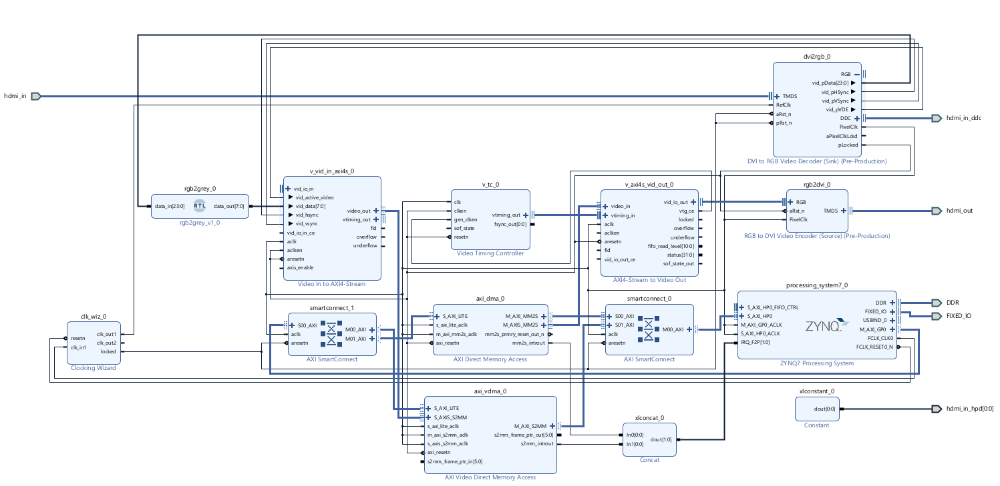

# RTL Edge Detection

## Description
A design focused on live video editing with the implementation of the Sobel Edge detection algorithm. 

The focus is own scalability and reusability in the modules I create and test. I wanted to focus on a system that can swap in different kernels or video effects, and even adding multiple to one input stream.

The RTL Edge Detection design takes in live video streaming data, and transforms it via kernel operations. 
The challenge of this design is that the sobel kernel requires pixels from other lines, so the video data must be buffered before it is modified. I wanted to make the design capable of having multiple process like blurring on top of the sobel. This increased the complexity significantly. 
But using hardware to perform operations on live data is incredibly powerful when done with FPGA's.

This was done on the PYNQ-Z2 board.

## Requirements
### Overall design
Less than 16.67 ms for total delay (from the time needed per frame @ 720p 60Hz)
Button to toggle effect?

### Internal Requirements
(Mainly for my own sanity and memory)
Syncs with output Video Timing Controller
Can handle different video resolutions (even rebuild if needed, this drives kernelizer to be parameterizable)

### Cool addons
Chain multiple effects together (Think this can be done with an AXI FIFO to avoid overwhelming the DMA controller)
HPD tied to something instead of constant

## Project Structure
### pyz2_videoDisplay
This folder contains all source files and the project file.
Including constraints, test benches, and imported designs.

### Vitis
Contains the Vitis project which consists of a Platform and Application component.
Platform is based on the PL XSA file running baremetal.
The Application DDR_video_buffer includes the main file for writing and reading video frames into the DDR through a circular buffer.

### Docs
[DECAPED] Contains LibreOffice documents pertaining to the design. Includes a Hardware Description Document detailing the design. And  block diagram presentation file for block diagram generation. 

### tcl_scripts
Contains scripts used to generate the project along with custom scripts developed for less GUI interfacing.

## Design
### Top Level

(Current WIP, does not include my custom RTL due to troubleshooting)
The top level design features wiring for the HDMI input and output port. Both of these are actually running DVI protocol and not HDMI. This is due to limitations of available IP for the PYNQ board and my time and development limitations. 

It is configured to accept 720p @60Hz. Any higher pushes the limits of what the board is capable. 

The DVI2RGB module handles the DDC output to the HDMI input data. This tells the source device what the setup is capable/configured to run.
The HPD (hot plug density) is also handled here. It is an on or off voltage to signal to the source device that a sink is present and allows the source to look DDC data to configure it's output. It is set to high constantly for ease.

A clock wizard provides the necessary clocking.

AXI interconnects are used for PS to PL blocks.
VDMA is used for writing into the DDR because entire frames will be written in. But a standard DMA is used to read out the pixels due to needing custom pointer movement.

### AXIS Edge Detection
This module handles the sobel edge detection algorithm. 
It tells the PS how it wants it's pixel data through registers accessible via AXI-lite interface.

It uses a matrix of rounded values to take advantage of bit shifting instead of multiplication operators. 

### DMA - Direct Memory Access
Initially, as stated above, the plan was to use only store a few rows of pixels instead of an entire frame. That was changed mainly for scalability and future growth. Instead of redoing multiple tracks of FIFO's, line buffers and kernelizers, the design would have a whole image to work on. 

This opened me to the world of DMA. Sadly the PYNQ-Z2 board has no PL to DDR controller wiring, so I had to instantiate the PS for passing along memory mapped data into the external 512 MB DDR.

The design features VDMA (video DMA) IP block for writing in the DDR.
~~However, a standard DMA block reads from the DDR. This is due to the need for certain pixels in the frame to be read out, instead of the entire frame.~~
It was import for me to take the time to fully understand what is happening from the VDMA to the PS to the DDR. I found this confusing, but the VDMA handles actually all the writing and reading once it has been configured by software. Software on the PS is only there to configure, initialize and monitor. It can do post processing.

### Timing and latency

### Resets

### Memory

## Development Plan
(reference Sim files and AXI VIP here too)

### Crawl
Implement a simple design that buffers video data into a higher clock domain memory and then back out.

First step was to implement the hardware and software to stores frames into the DDR. DONE
Next was to read into DDR 

### Walk
Add effects to the buffered video data like saturation via external input of say a button press.

### Run

## Getting Started
Needed: 
   A ZYNQ-7000 board with at least two interfaces for video input and output. I found that using HDMI cables for both DOES       NOT WORK. I am guessing this is because the sink assumes since it is coming in the HDMI port, that is should be HDMI. I    found using a HDMI to DVI/VGA converter in the cable fixes it.
   Two cables for video data. 
   A power cable for the board. 
   DDR either on the PS or PL side capable of storing a few frames of data at resolution. I am access it through the PS.

### Setup

### Execution

## References
Implementation of the algorithm:
https://en.wikipedia.org/wiki/Sobel_operator
https://homepages.inf.ed.ac.uk/rbf/HIPR2/sobel.htm

Convolver
https://thedatabus.in/convolver

The following are designs used in the development of my own. 
https://github.com/JeffreySamuel/canny_edge_detection_in_FPGA/blob/main/README.md
https://github.com/tharunchitipolu/sobel-edge-detector
https://github.com/AngeloJacobo/FPGA_RealTime_and_Static_Sobel_Edge_Detection/blob/main/src1/top_module.v
DMA: https://logictronix.com/wp-content/uploads/2022/03/ZedBoard-Video-Frame-Buffer-Read_Write-Reference-Design-LRFD030.pdf

## Authors

Victoria Polda
www.linkedin.com/in/victoriapolda

## Version History

* 0.1
    * Initial Release

## License

MIT License

Copyright (c) 2024 Victoria Polda

Permission is hereby granted, free of charge, to any person obtaining a copy
of this software and associated documentation files (the "Software"), to deal
in the Software without restriction, including without limitation the rights
to use, copy, modify, merge, publish, distribute, sublicense, and/or sell
copies of the Software, and to permit persons to whom the Software is
furnished to do so, subject to the following conditions:

The above copyright notice and this permission notice shall be included in all
copies or substantial portions of the Software.

THE SOFTWARE IS PROVIDED "AS IS", WITHOUT WARRANTY OF ANY KIND, EXPRESS OR
IMPLIED, INCLUDING BUT NOT LIMITED TO THE WARRANTIES OF MERCHANTABILITY,
FITNESS FOR A PARTICULAR PURPOSE AND NONINFRINGEMENT. IN NO EVENT SHALL THE
AUTHORS OR COPYRIGHT HOLDERS BE LIABLE FOR ANY CLAIM, DAMAGES OR OTHER
LIABILITY, WHETHER IN AN ACTION OF CONTRACT, TORT OR OTHERWISE, ARISING FROM,
OUT OF OR IN CONNECTION WITH THE SOFTWARE OR THE USE OR OTHER DEALINGS IN THE
SOFTWARE.

## Acknowledgments

